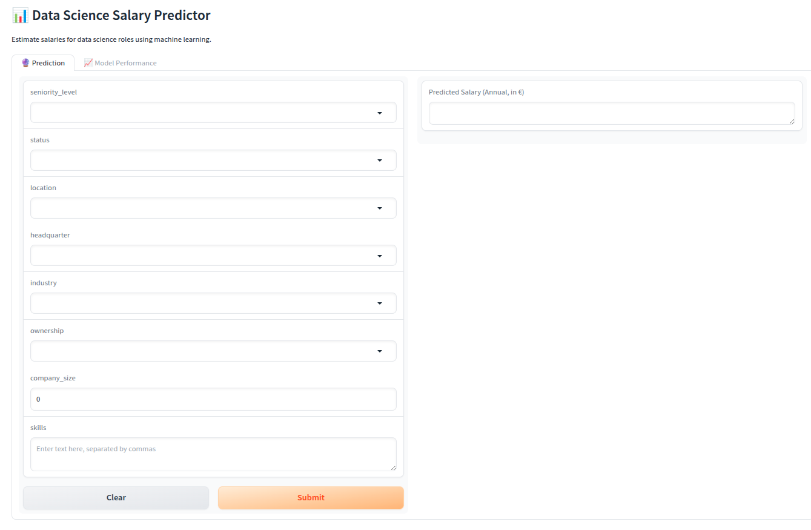

# 🚀 Data Science Salary Estimation  

## 📌 Overview
This project showcases a **full end-to-end Machine Learning pipeline** for estimating data scientist salaries, built from scratch. It covers **data scraping, cleaning & EDA, preprocessing, feature engineering, model training, hyperparameter tuning, evaluation, deployment, and a client-facing Gradio app**.  
Additionally, the project includes **inferential statistics analysis** (hypothesis testing & confidence intervals) to derive insights about salaries.

While salary prediction is inherently noisy, the focus is on demonstrating **practical ML workflows, deployment, and portfolio-ready engineering skills**.  

**Note:** Here a general overview is provided. More details abot the data distributions, model card, & the implementation guideline are available in the `docs/` directory.

**Goal:** Showcase **end-to-end data science skills** in a clean, reproducible pipeline.

---
## 🚀 Live Demo

---
## 💻 Code and Resources Used
- **Python Version**: 3.9.12  
- **Packages**: pandas, numpy, scikit-learn, matplotlib, seaborn, selenium, pickle, gradio, metaflow

---

## 🔍 Data Pipeline
- **Crawling**: Over 1000 job postings scraped using Python and Selenium.  
- **Data Cleaning**: Extracted skill sets, experience, company info, industry, and location. Data types were fixed and string manipulation applied to extract purely numerical features. Some features were **derived from job descriptions using LLM APIs**, which are not published here **to respect the source website’s privacy policy**.
- **EDA**: Exploratory Data Analysis to understand distributions, correlations, and outliers before modeling.
- **Preprocessing**:  
  - Dropped non-informative features 
  - Ordinal encoding for `seniority_level` (`junior < midlevel < senior < lead`)  
  - Handling missing values, categorical encoding, numerical transformations

> ⚠️ **Note on Data Privacy**  
> To respect the privacy policy of the source platforms, the **exact websites are not disclosed**. Data is also **manipulated, cleaned, and transformed** before being published to avoid sharing raw proprietary content. The file at `data/raw_df.csv` is therefore a **processed version** of the original scraped data.

---

## 📊 Inferential Statistics

We conducted hypothesis testing and confidence interval analysis to explore salary-related questions, including:

1. Whether the true mean salary differs from the claimed $128,000 benchmark.  
2. Whether senior data scientists earn significantly higher salaries than junior/mid-level peers in the US.  
3. Whether job location type (remote/hybrid vs. on-site) impacts mean salaries.  

The analysis and results are documented in the `notebooks/data_science_salary_Inferential_statistics.ipynb`.

---

## 🧠 Modeling
- Built a custom pipeline for **feature selection** and model comparison using **RFE + cross-validation**.  
- Implemented:  
  - Model comparison: Linear Regression, Ridge, Lasso, **Random Forest (best)**, Gradient Boosting, XGBoost  
  - Selection of best model based on mean CV score  
  - Storing selected features and final model  
- Feature subsets tested: 15, 20, 25, 30, 35, 40, 57 features  
- **Hyperparameter tuning** applied to Random Forest  
- Final Random Forest Regressor trained with best parameters and exported  
- **Built a client-facing API using Gradio** for interactive model inference 

---

## 🔄 Automated Pipeline Execution

The entire data science workflow — including **data preparation, model training, fine-tuning, and evaluation** — can be orchestrated automatically using the `pipeline.py` script powered by **Metaflow**.

Run the pipeline end-to-end:

    python pipeline.py run --prepare --train --fine-tune

This executes all steps defined in the pipeline:
- **prepare** → Data splitting and preprocessing  
- **train** → Feature selection, model training, and optional fine-tuning  
- **evaluate** → Model evaluation and reporting  

Each stage uses the parameters defined in `config.yaml`, making the process **fully reproducible and configurable**.

> 💡 **Tip:** You can selectively run specific stages by omitting flags.  
> Example:  
>
>     python pipeline.py run --evaluate
>
> will only run the evaluation phase.

---

## 📊 Evaluation Results
| Metric | Best RF Model | Description |
|--------|---------------|-------------|
| R² | ~0.57 | Explains about half of the variance → decent given noisy features, but not strong enough for real-world salary prediction. |
| MAE | ~€30k | (~25% of average salary): Too large for practical salary modeling. |
| RMSE | ~€42k | Indicates large average error magnitude, reinforcing limited practical accuracy. |
| MAPE | ~42% | Very high → poor for low-salary roles (e.g., $60K predicted as $90K = 50% error). |

**Interpretation**: model captures general salary trends but not precise values; salary prediction is inherently noisy.

> ⚠️ **Note on Model Improvement Attempts**  
> Early performance was poor. Several improvements were tested, with the most effective being encoding `seniority_level` as an ordinal rather than categorical feature. This ensured the model **never predicted lower salaries for higher seniority levels (all else equal)**, solving the “senior ≈ junior” salary collapse observed initially.  
> More details on these steps are available in the `docs/` directory.

---

## ⚠️ Limitations
The main bottleneck is not preprocessing, feature selection, or model choice—all of which were explored. Instead, the issue lies in the **signal itself**: the most informative features explaining salary variance are either **missing or too noisy**.  
- Small dataset (~750 training samples, ~180 test samples)  
- Missing strong explanatory signals (e.g., job function, company reputation, detailed skills)  
- Noisy features: job postings often omit or exaggerate details  
- MAPE > 40% → predictions not business-grade accurate  

---
## 🚀 Next Steps
- Reframe as **classification** (low/mid/high salary buckets)  
- Gather **more data** across industries, regions, roles  
- Try **stacking/ensembling** models for robustness  

---

## ⚖️ License  

This project is licensed under the **MIT License** – you are free to use, modify, and distribute it.  

---

