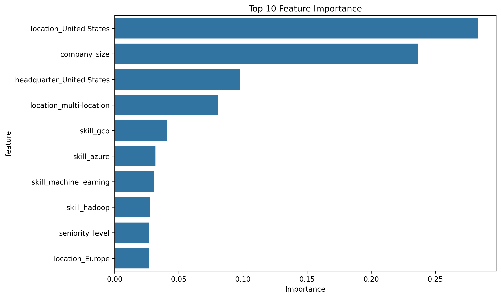
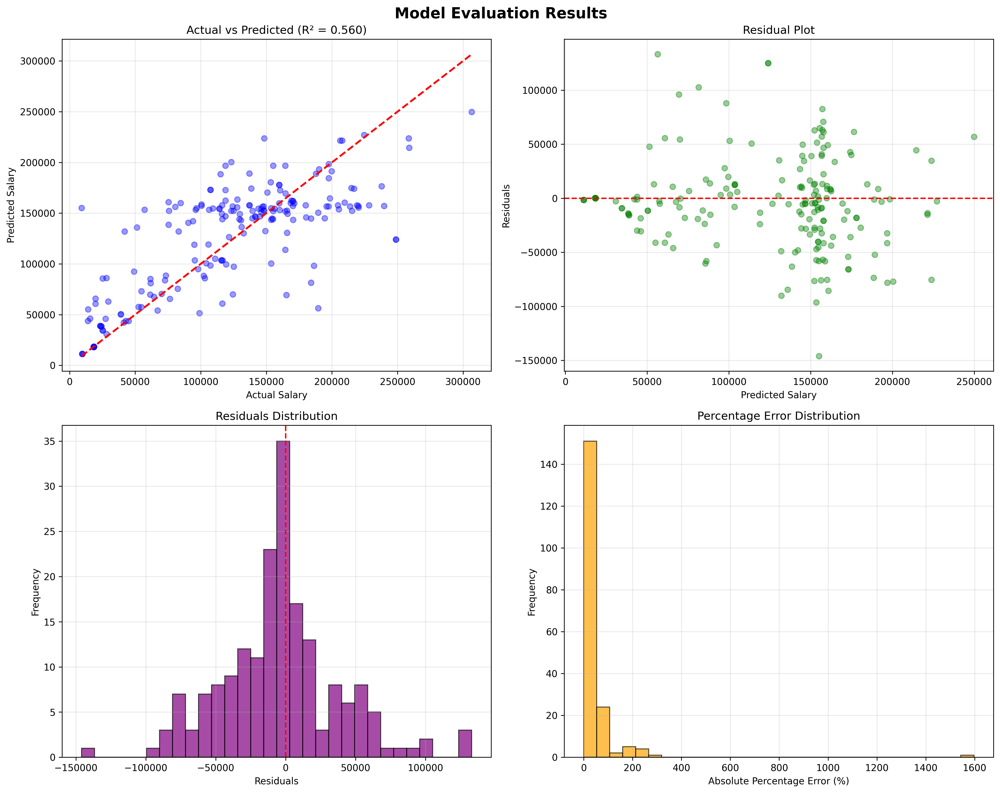

# 🧾 Model Card: Data Science Salary Estimation

## Model Details
- **Author**: Elaheh Golrokh  
- **Repo**: [GitHub Link](https://github.com/ElahehGolrokh/data-science-salary-range)  
- **Frameworks**: scikit-learn, XGBoost, pandas, NumPy  
- **Version**: v1.0  

---

## Intended Use
This model estimates **data scientist salaries** based on job-related features (e.g., title, skills, seniority, industry).  
It is primarily intended for:  
- Educational purposes  
- Demonstrating end-to-end ML pipelines  
- Portfolio showcasing  

⚠️ **Not intended for hiring, financial, or HR decision-making.**

---

## Training Data
- Raw data collected via web scraping job postings.  
- Feature engineering included:  
  - Extracting job industry and copany details using LLM APIs  
  - Converting `seniority_level` to ordinal  
  - Encoding categorical features    

---

## Evaluation Results
- **Model used**: LinearRegression / Lasso / Ridge / GradientBoostingRegressor / XGBRegressor /  RandomForestRegressor (with hyperparameter tuning)  
- **Metrics**:

| Metric | Best RF Model | Description |
|--------|---------------|-------------|
| R² | ~0.57 | Explains about half of the variance → decent given noisy features, but not strong enough for real-world salary prediction. |
| MAE | ~€30k | (~25% of average salary): Too large for practical salary modeling. |
| RMSE | ~€42k | Indicates large average error magnitude, reinforcing limited practical accuracy. |
| MAPE | ~42% | Very high → poor for low-salary roles (e.g., $60K predicted as $90K = 50% error). |

📉 Salary prediction is inherently noisy. Results show moderate predictive power but large variance due to dataset limitations.  

### 📊 Evaluation Plots

This section provides visual insights into model behavior and performance.

#### 🔑 Feature Importance
- Displays the **top contributing features** of the final model.  
- Helps interpret which factors most strongly influence predicted salaries.  

  

#### 📈 Key Evaluation Plots
- **Residuals plot** → shows how well the model fits across predictions.  
- **Predicted vs. Actual plot** → visual comparison of model accuracy.  
- **Error distribution** → distribution of prediction errors.  

  

#### 🏆 Model Comparison
- Diagram comparing multiple trained models based on **RMSE, MAE, and R²**.  
- Highlights trade-offs and justifies final model selection.  

  

---

## Limitations & Ethical Considerations
- Salaries depend on negotiation, company policies, and external market factors not captured in the dataset.  
- Predictions should not be used for **employment or financial decisions**.  
- Risk of bias if dataset under-represents certain roles, regions, or industries.  

---

## Features Used

Job title

Seniority level (ordinal)

Industry

Required skills (encoded)

Location (if available)
